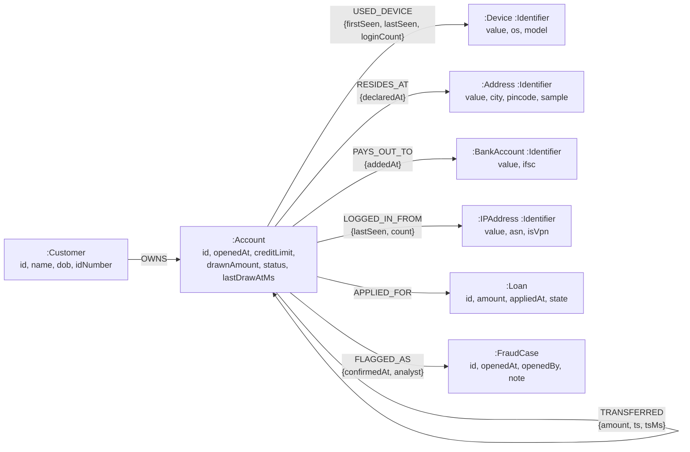

# Ringfence

**Fraud-ring detection for a digital lending portfolio, built on a graph database.**

Ringfence finds organised fraud rings by treating the things accounts *share* — a handset, a
payout account, a doorway, a network — as nodes you can travel through rather than columns you
can only group by. It surfaces the clusters that look organised, lets an analyst trace and
confirm them, and checks new applicants against the whole graph before money moves.

| | |
|---|---|
| **Live demo** | **https://ringfence-kappa.vercel.app** |
| **Screen recording** | _<add recording URL>_ |
| **Database** | CognoDB free `c0` — openCypher over Bolt 5, via the official `neo4j-driver` |
| **Stack** | Next.js 16 (App Router, RSC), TypeScript strict, Tailwind v4, `react-force-graph-2d` |
| **Dataset** | 15,512 nodes · 25,516 relationships · 6 planted rings · 30 ground-truth fraud labels |

---

## The problem

A digital lending app approves small loans in about ninety seconds, mostly automatically.

**Monday.** Ravi Kumar applies. Valid ID, phone verified by OTP, no defaults anywhere,
plausible income. The model approves ₹25,000. Nothing about the application is unusual.

**Over six weeks,** forty more applications arrive and are approved the same way. All clean
individually.

**Then, across seventy-two hours,** all forty-one accounts draw their maximum limit and go
silent. Phones disconnected. ₹1.1 crore gone.

The post-mortem is where it gets interesting. Thirty-eight different names, forty-one different
phone numbers, forty-one different ID documents. Nothing obviously shared. But nine of them
logged in from the same physical handset. Fourteen sent their payout to just six bank accounts.
Twenty-two had an address matching *another account in the group* — not all the same address, a
**chain**: Ravi and Sunita share an address, Sunita and Amit share a bank account, Amit and
Priya share a device. Ravi and Priya share nothing at all. And in the quiet weeks beforehand
they had been sending each other ₹500 in loops, to make dormant accounts look creditworthy.

> **No single account was suspicious. The fraud existed only in the connections between accounts.**

This is a **bust-out fraud ring**, and it is one of the most common attacks on any lending,
wallet, BNPL or marketplace platform. Sardine, Unit21, Sift and Feedzai all sell products in
this category; graph-based ring detection is the flagship enterprise use case for graph
databases generally.

---

## Why a graph database?

### The mechanism: traversal cost is *local*, not *global*

A relational database stores rows and works out connections **at query time** by searching an
index for matching keys. That search is a join, and you pay for it once per hop, over the whole
table, and it grows as your data grows.

A graph database stores the connections themselves on disk. Each node record physically holds
the addresses of its relationship records, so following a hop is dereferencing a pointer —
there is nothing to search, because the answer was written down in advance. This is called
**index-free adjacency**, and it means a hop costs whatever *that node's* neighbour count costs,
regardless of whether the database holds ten thousand accounts or ten million.

Every argument below is downstream of that one property.

### The four things a relational schema misses

**1 · Chains.** This is the case that motivated the whole model.

```
        ┌── no shared identifier between the ends — invisible to a GROUP BY ──┐
        ╎                                                                     ╎
     ( A )              ( B )              ( C )              ( D )
        \               /   \              /   \              /
         ◆ Address ────┘     ◆ BankAcct ──┘     ◆ Device ────┘
          (1 hop)             (2 hops)           (3 hops)
```

Each adjacent pair shares exactly one identifier, so a *shared device* rule catches C–D and a
*shared address* rule catches A–B — but nothing ever connects A to D. One Cypher pattern walks
all three hops in a single traversal and returns the whole ring. The relational equivalent needs
a different set of self-joins for every possible ordering of identifier types, and you must know
the depth before you write the query.

This is not hypothetical here. Ring 3 in the seed data is exactly this shape, and the live
system returns:

```
ACC-02022 → addr:15suthar…  → ACC-02023 → bank:KKBK…8372 → ACC-02024
          → dev:07aea3…     → ACC-02025 → ip:209.195…    → ACC-02026

4 hops · RESIDES_AT → PAYS_OUT_TO → USED_DEVICE → LOGGED_IN_FROM
Direct identifiers shared between ACC-02022 and ACC-02026: 0
```

**2 · Unknown depth.** Is the ring two hops wide or five? SQL requires you to decide before
writing the query.

**3 · Cycles.** "Find money that goes A → B → C → A." There is no clean way to express this in
SQL at all.

**4 · The path itself is the answer.** An analyst does not want a boolean. They need
*this applicant → shares a device with → ACC-4471 → paid out to the same bank as → ACC-2210,
confirmed fraud*. That chain **is** the evidence that goes in the case file. SQL returns rows;
the analyst needs a route.

### Side by side

The easy part is easy in both. Accounts sharing a device directly:

```sql
SELECT device_id, COUNT(*) FROM account_devices
GROUP BY device_id HAVING COUNT(*) > 3;
```

Now the actual question — *find any account reachable from this one through up to three shared
identifiers of any kind, and give me the route*:

```sql
-- PostgreSQL. Loop prevention, depth tracking and route accumulation are all manual.
WITH RECURSIVE reach(from_id, to_id, depth, route) AS (
  SELECT a.account_id, b.account_id, 1,
         ARRAY[a.account_id, b.account_id]
    FROM account_devices a JOIN account_devices b USING (device_id)
   WHERE a.account_id = $1 AND b.account_id <> a.account_id
  UNION ALL
  SELECT a.account_id, b.account_id, 1, ARRAY[a.account_id, b.account_id]
    FROM account_addresses a JOIN account_addresses b USING (address_id)
   WHERE a.account_id = $1 AND b.account_id <> a.account_id
  UNION ALL   -- ...and again for bank accounts, and again for IPs
  SELECT r.from_id, nxt.account_id, r.depth + 1, r.route || nxt.account_id
    FROM reach r
    JOIN ( SELECT a.account_id AS src, b.account_id FROM account_devices a
             JOIN account_devices b USING (device_id) WHERE a.account_id <> b.account_id
           UNION ALL
           SELECT a.account_id, b.account_id FROM account_addresses a
             JOIN account_addresses b USING (address_id) WHERE a.account_id <> b.account_id
           UNION ALL  -- ...and again, and again
         ) nxt ON nxt.src = r.to_id
   WHERE r.depth < 3
     AND NOT nxt.account_id = ANY(r.route)          -- hand-written cycle prevention
)
SELECT DISTINCT to_id, MIN(depth), route FROM reach GROUP BY to_id, route;
```

```cypher
// Cypher. The depth is a number, the identifier kinds are a parameter,
// and the route comes back as part of the answer.
MATCH (a:Account {id: $accountId})
MATCH p = shortestPath((a)-[:$linkTypes*..6]-(b:Account))
RETURN [n IN nodes(p) | coalesce(n.id, n.value)] AS route, length(p) / 2 AS hops
```

And the one with **no clean SQL equivalent at all** — money that leaves an account and comes
back:

```cypher
MATCH (a:Account) WHERE a.id IN $accountIds
MATCH p = (a)-[:TRANSFERRED*2..3]->(b:Account)
MATCH (b)-[closing:TRANSFERRED]->(a)
WITH p, closing, relationships(p) AS legs
WHERE all(r IN legs WHERE r.amount <= $maxLegAmount) AND closing.amount <= $maxLegAmount
RETURN [n IN nodes(p) | n.id] AS accounts, size(legs) + 1 AS legs,
       reduce(s = 0.0, r IN legs | s + r.amount) + closing.amount AS totalMoved
```

**One honest caveat, because overstating this is the fastest way to lose an argument:** a
recursive CTE genuinely *can* walk a variable-depth chain. What is true is that you hand-write
the cycle prevention, hand-track the depth, repeat the whole `UNION ALL` block once per
identifier type, and the engine re-searches an index at every level. Depth-bounded search in SQL
is *painful*; **cycle detection is the case with no clean expression.** Lead with the second.

---

## Data model



The four identifier edges are the whole mechanism: because each shared attribute is a **node**
rather than a column, `Account → identifier → Account` is a two-hop journey, and one traversal
pattern can mix all four identifier kinds to any depth.

### Nodes

| Label | Properties | Purpose |
|---|---|---|
| `:Customer` | `id`, `name`, `dob`, `idNumber` | The *claimed* identity — usually fabricated in a ring |
| `:Account` | `id`, `openedAt(Ms)`, `creditLimit`, `drawnAmount`, `status`, `lastDrawAt(Ms)` | The app account; everything hangs off this |
| `:Device:Identifier` | `value` (fingerprint), `os`, `model` | A physical handset |
| `:Address:Identifier` | `value` (normalised), `city`, `pincode`, `sample` (raw) | Normalisation matters — see decision 3 |
| `:BankAccount:Identifier` | `value` (masked), `ifsc` | Payout destination; the strongest mule signal |
| `:IPAddress:Identifier` | `value`, `asn`, `isVpn` | Weakest signal — offices and colleges share IPs innocently |
| `:Loan` | `id`, `amount`, `appliedAt`, `state` | Has its own lifecycle, so a node not a property |
| `:FraudCase` | `id`, `openedAt`, `openedBy`, `note` | Ground truth; the seed points risk is measured from |

### The five decisions worth defending

**1 · Shared identifiers are nodes, not columns.** If `device_fingerprint` is a column on the
accounts table, the only operation available is `GROUP BY`. Making `Device` a node turns it into
*a place you can travel through*, so `Account → Device → Account` is a two-hop journey. Because
all four identifier kinds are nodes, one pattern can mix them to arbitrary depth — which is what
finds the chain ring. **General rule: if you want to traverse through something, it must be a
node.**

**2 · Identifier edges hang off `:Account`, not `:Customer`.** `Customer` holds the claimed
identity, which is usually fake. Attaching every shared identifier to `Account` means one
uniform traversal pattern rather than some hops passing through Customer and some not — and it
makes every path length reliably even, so `hops = length(path) / 2`.

**3 · Identifier values are normalised, then namespaced.** Addresses arrive as free text.
`src/lib/normalise.ts` folds case, turns every non-alphanumeric run into a gap, expands
abbreviations *while word boundaries still exist*, then discards separators entirely.

> This order is the whole algorithm, and my first version got it wrong. Keeping separators in the
> final key meant `12/A, M.G. Road` tokenised as `12 | a | m | g | road` while `12A MG Rd`
> tokenised as `12a | mg | road` — same doorway, different keys, and **ring 5 silently did not
> exist**. I only caught it because the verification script asserted "seven variants → one node"
> instead of eyeballing the output. Whitespace in an address is typing noise, not information.

Values are then namespaced by kind (`dev:`, `addr:`, `bank:`, `ip:`) so a single uniqueness
constraint on `:Identifier(value)` can never collide across kinds.

**4 · A shared `:Identifier` label alongside the specific one.** Every identifier node carries
two labels, e.g. `:Device:Identifier`. The specific label keeps queries readable and lets signals
be weighted differently; the shared label means **one index resolves any identifier lookup** —
essential for Applicant Check, where you hold a bag of mixed values and there is no account node
yet. Recover the specific kind with `[l IN labels(n) WHERE l <> 'Identifier'][0]`.

**5 · Transfers are relationships; loans are nodes.** A transfer is two endpoints and two
properties, and keeping it a relationship is what makes cycle detection expressible at all. A
loan has its own lifecycle and things attach to it, so it is a node.

### Constraints and indexes

Created **before** any data is loaded. Every `MERGE` below matches on a property; without a
backing index that match is a full label scan, so loading gets *quadratically* slower as it
runs — the first thousand accounts load in seconds and the last thousand take minutes.

```cypher
CREATE CONSTRAINT account_id     IF NOT EXISTS FOR (a:Account)    REQUIRE a.id IS UNIQUE;
CREATE CONSTRAINT customer_id    IF NOT EXISTS FOR (c:Customer)   REQUIRE c.id IS UNIQUE;
CREATE CONSTRAINT identifier_val IF NOT EXISTS FOR (n:Identifier) REQUIRE n.value IS UNIQUE;
CREATE CONSTRAINT loan_id        IF NOT EXISTS FOR (l:Loan)       REQUIRE l.id IS UNIQUE;
CREATE CONSTRAINT fraudcase_id   IF NOT EXISTS FOR (f:FraudCase)  REQUIRE f.id IS UNIQUE;
CREATE INDEX account_status      IF NOT EXISTS FOR (a:Account)    ON (a.status);
CREATE INDEX account_lastdraw    IF NOT EXISTS FOR (a:Account)    ON (a.lastDrawAtMs);
```

---

## The queries

All seven live in [`src/queries/`](src/queries/), one exported function each, with the Cypher as
a template literal and a comment explaining the shape. Every value goes through `$parameters`.

| # | File | What it answers |
|---|---|---|
| Q1 | [`rings.ts`](src/queries/rings.ts) | Which identifiers are shared by 2+ accounts, excluding super-nodes |
| **Q2** | [`traversal.ts`](src/queries/traversal.ts) | **Multi-hop traversal** — expand a neighbourhood 1–3 account hops |
| **Q3** | [`traversal.ts`](src/queries/traversal.ts) | **Awkward for SQL** — shortest path to a confirmed fraud account |
| **Q4** | [`cycles.ts`](src/queries/cycles.ts) | **No clean SQL equivalent** — circular money movement |
| Q5 | [`applicant.ts`](src/queries/applicant.ts) | Resolve a new applicant's raw values and measure distance to fraud |
| Q6 | [`mutations.ts`](src/queries/mutations.ts) | Write the analyst's decision back into the graph |
| Q7 | [`health.ts`](src/queries/health.ts) | Liveness, and the counts that drive empty states |

### Q1 — shared identifier groups

Returns identifier **groups**, not account pairs. One identifier shared by *k* accounts is one
row here instead of `k(k−1)/2` pair rows, and the group form already carries the member count
the risk score needs.

```cypher
MATCH (n:Identifier)<-[r:$linkTypes]-(a:Account)
WITH n, type(r) AS kind, collect(DISTINCT a.id) AS accountIds
WHERE size(accountIds) >= 2 AND size(accountIds) <= $maxDegree
RETURN n.value AS value, kind, accountIds
ORDER BY size(accountIds) DESC
```

The `$maxDegree` filter does **two jobs with one line**. *Evidentially*, a college WiFi IP with
40 accounts on it is not a fraud ring, and letting it through merges 40 unrelated accounts into
one meaningless cluster. *Computationally*, a traversal entering a node of degree 40 and leaving
by every other edge does 40 × 40 work at that hop. The seed data deliberately contains one
identifier **above** the cutoff (a 40-account college IP, excluded) and one just **below** it (a
12-account office IP, kept — and it correctly scores 19 out of 100).

> **Why the spec's original threshold was wrong.** An earlier design filtered to account pairs
> sharing **two or more distinct kinds** of identifier, reasoning that "two accounts sharing only
> an address is a family". That reasoning is sound but belongs in *scoring*, not in a hard gate:
> five of the six planted rings share exactly one kind (a device farm shares only devices), so
> the filter removed them and the home page rendered **empty**.

### Q2 — multi-hop traversal *(the brief's explicit requirement)*

```cypher
MATCH (seed:Account {id: $accountId})
MATCH p = (seed)-[:$linkTypes*1..6]-(other)
WHERE all(n IN nodes(p) WHERE NOT n:Identifier OR COUNT { (n)<--() } <= $maxDegree)
WITH p LIMIT $maxPaths
UNWIND relationships(p) AS r
WITH DISTINCT r
RETURN startNode(r) …, endNode(r) …, type(r) AS kind
```

Returns a distinct **edge list** rather than paths, because that is exactly the shape a
force-directed graph component consumes and the node set is derivable from it.

### Q3 — shortest path to known fraud *(awkward for SQL)*

```cypher
MATCH (a:Account {id: $accountId})
MATCH (fraud:Account)-[:FLAGGED_AS]->(:FraudCase)
WHERE fraud.id <> a.id
MATCH p = shortestPath((a)-[:$linkTypes*..8]-(fraud))
RETURN fraud.id AS fraudAccount, length(p) / 2 AS hops,
       [n IN nodes(p) | { label: [l IN labels(n) WHERE l <> 'Identifier'][0],
                          value: coalesce(n.id, n.value) }] AS chain,
       [r IN relationships(p) | type(r)] AS links
ORDER BY hops ASC LIMIT 5
```

Length divides by two because every account-to-account hop passes through one identifier node.

### Q4 — circular money movement *(no clean SQL equivalent)*

**This query had to be rewritten after probing the live engine, and the reason is the single most
useful thing this project learned about CognoDB.**

The obvious form returns nothing:

```cypher
MATCH cycle = (a:Account)-[:TRANSFERRED*3..5]->(a)   -- always 0 rows on CognoDB
```

CognoDB applies **node uniqueness** to variable-length patterns: a matched path may never revisit
a node. Neo4j applies **relationship uniqueness**, where a path may revisit a node so long as it
does not reuse an edge. Under node uniqueness a closed walk is unmatchable *by definition* —
arriving back at the start **is** a revisited node.

The fix is to decompose the cycle into an acyclic segment plus a separately matched closing edge:

```cypher
MATCH (a:Account) WHERE a.id IN $accountIds          -- anchor FIRST (see below)
MATCH p = (a)-[:TRANSFERRED*2..3]->(b:Account)       -- acyclic: node-unique, legal
MATCH (b)-[closing:TRANSFERRED]->(a)                 -- closing edge, separate pattern
WITH p, closing, relationships(p) AS legs
WHERE all(r IN legs WHERE r.amount <= $maxLegAmount) AND closing.amount <= $maxLegAmount
RETURN [n IN nodes(p) | n.id] AS accounts, size(legs) + 1 AS legs,
       reduce(s = 0.0, r IN legs | s + r.amount) + closing.amount AS totalMoved
```

Two more things this query encodes, both measured rather than guessed:

- **`relationships(p)`, not a `-[t:TRANSFERRED*2..3]-` variable.** On CognoDB that variable binds
  to a `Path`, not a list, so `all(r IN t …)` raises *"all() requires list, got Path"*.
- **Anchor the start nodes before expanding.** Writing
  `MATCH p = (a:Account)-[:TRANSFERRED*2..4]->(b) WHERE a.id IN $ids` expands from all 2,049
  accounts and *then* discards all but the candidates — a hard
  `Neo.TransientError.General.OutOfTimeError`. Binding `a` first: **1,981 ms**.

Depth also stops at 3 for a measured reason: `*2..4` took **11.9 s** for 48 rows, `*2..3` takes
**3.2 s** for 28 — each extra hop multiplies by the average out-degree, and the longer cycles are
already found at a shorter length by another rotation. Confining the path to the candidate set was
tried too and made it *slower* (16.1 s), because the extra predicate is evaluated per path, after
the expansion it was meant to avoid.

### Q5 — Applicant Check

The applicant has no `:Account` node yet, so step one resolves their raw values against existing
nodes — which is exactly what the shared `:Identifier` label and its single index exist for.
Values pass through the **same** normalisation functions the loader used; if those ever diverged,
an applicant typing the identical address already in the graph would silently fail to match it.

### The one place a value is interpolated into Cypher

Two things in Cypher cannot be parameters. `scripts/probe.ts` runs both deliberately and reports
the result rather than asserting it:

| Construct | On CognoDB | What this codebase does |
|---|---|---|
| Relationship type as `$param` | **Supported**, including in variable-length patterns and as a *list* | Read queries pass `$linkTypes` — **no interpolation at all** |
| Relationship type in `MERGE` | Accepted but **ignored when matching** — returns a relationship of a *different type* | Loader uses a literal from `LINK_TYPES`, an `as const` array |
| Node label as `$param` | Rejected | Loader runs one pass per kind, label from `IDENTIFIER_KINDS` |
| Variable-length depth as `$param` | Rejected — syntax error | Frozen map of pre-built query strings, keyed by a Zod enum |

So the interpolated values are: relationship types and labels **in the loader only**, from
hard-coded `as const` arrays; and path depths, selected from a frozen map after Zod validation.
No caller-supplied string can reach a query. Every *value* — account ids, identifier values,
thresholds, limits — travels as `$params`.

The `MERGE` finding is worth flagging to the CognoDB team: passing `$relType` to `MERGE` matched
an existing relationship of an unrelated type instead of creating the requested one. In a loader
that is silent data corruption.

### Why connected components are computed in TypeScript

Grouping connected accounts into rings is the weakly-connected-components problem. In Neo4j you
would call `gds.wcc()`. The Graph Data Science library is a Neo4j extension, not part of
openCypher, and the probe confirms it is absent — along with APOC.

So Cypher returns the **edges** and a ~30-line union-find in
[`src/lib/cluster.ts`](src/lib/cluster.ts) derives the components. On a few hundred groups that is
single-digit milliseconds, it is unit-testable, and it is explicit rather than a black box. The
whole pipeline is cached for 60 seconds and tagged, so a burstable 0.5 vCPU instance is not asked
to recompute it per page view — and a write-back invalidates the tag so decisions appear at once.

Rings are components over **two** edge sources — shared identifiers **and** transfer cycles —
because ring 4 shares no identifiers at all and exists only in the money movement.

### Ring ids are derived, not indexed

A ring's id comes from its smallest member account (`ACC-02040` → `r-acc-02040`, displayed
`RING-02040`). An index into a risk-sorted array would change every time a decision was written
back, breaking every bookmarked URL.

---

## Seed data

Generated, not sourced, and the reasoning belongs here:

- **Real fraud graphs are private by definition.** No lender publishes theirs.
- **The public fraud datasets are the wrong shape.** IEEE-CIS and PaySim are flat anonymised
  tables of columns like `V127` and `card3`, with no shared-entity structure at all — precisely
  the structure this model exists to exploit. Using them would make the graph *worse*.
- **A generator gives known ground truth.** Six rings were planted, so "detection found six
  rings" is a claim that can be checked rather than asserted.

`scripts/generate-data.ts` uses a fixed RNG seed **and a fixed reference date**, so the dataset is
byte-identical on every run — verified by hashing the output across regenerations. The JSON is
committed, so a reviewer can inspect the data without running the generator.

### The planted rings, and what detection recovered

| # | Signature | Only a graph finds it? | Detected | Risk | Rank |
|---|---|---|---|---|---|
| 1 | Device farm — 12 accounts, 2 handsets | no, a rule catches this too | `RING-02001` | 69 | #2 |
| 2 | Mule payout — 9 accounts → 3 bank accounts | no | `RING-02013` | 59 | #3 |
| 3 | **Chain** — A–B–C–D–E, ends share nothing | **yes** | `RING-02022` | 33 | #4 |
| 4 | **Circular transfers** — no shared identifiers at all | **yes** | `RING-02027` | 20 | #5 |
| 5 | **Address variants** — 7 accounts, 7 spellings, 1 doorway | **yes** | `RING-02033` | 18 | #9 |
| 6 | Dormant bust-out — quiet 6 weeks, all draw max in 72 h | **yes** | `RING-02040` | 79 | #1 |

Rings 1 and 2 are in the dataset **on purpose**: a conventional rule engine catches them, and
that baseline is what makes rings 3 and 4 impressive by contrast.

### Deliberate false positives

A detector that flags everything connected is useless. These are real overlaps with innocent
explanations, and the demo shows them scoring low next to the planted rings:

| Noise | Effect |
|---|---|
| 60 families sharing a home address (2–4 accounts) | Score **5** — one weak link kind, small, no transfers |
| One college WiFi IP, 40 accounts | **Excluded entirely** — above the degree cap |
| One office IP, 12 accounts | Score **19** — survives the cap, but `LOGGED_IN_FROM` is weighted 0.15 |
| 15 couples sharing a bank account | Never a ring — a pair is below `MIN_RING_SIZE` |
| 80 accounts with two devices (phone upgrades) | No sharing; pure noise |

The scoring is hand-tuned domain judgment, itemised on every ring page so an analyst can see
*why* a number is 79. A score whose reasoning is invisible gets overridden or over-trusted.

---

## Setup

```bash
# 1 · Create a free CognoDB instance
#     https://console.cognodb.com/signup → free (c0) instance → COPY THE PASSWORD,
#     it is shown exactly once.

# 2 · Configure
cp .env.example .env.local        # then paste your URI and password

# 3 · Install
npm install

# 4 · Optional but recommended: verify which Cypher features your instance supports
npm run probe                     # writes docs/cognodb-probe.md

# 5 · Generate and load the dataset (~2 minutes; run from your machine, not serverless)
npm run generate                  # data/*.json — deterministic
npm run seed                      # constraints → indexes → batched UNWIND, then verifies counts

# 6 · Run
npm run dev                       # http://localhost:3000
```

`npm run reset` empties the database in bounded batches — a single `DETACH DELETE` over 25,000
relationships exhausts 256 MB of heap on a free instance.

Every script uses `--env-file-if-exists` rather than `--env-file`, so a missing `.env.local`
produces `cp .env.example .env.local` instructions instead of a Node `ENOENT` trace.

---

## Architecture

```
src/
├── lib/
│   ├── env.ts          Zod-validated config, validated LAZILY (see below)
│   ├── db.ts           driver singleton + readQuery / writeQuery
│   ├── errors.ts       Neo4jError codes → user-facing sentences
│   ├── normalise.ts    identifier canonicalisation — used at seed AND query time
│   ├── cluster.ts      union-find + risk scoring
│   ├── detect.ts       the detection pipeline
│   ├── detect-cached.ts  60s tagged cache for Server Components
│   ├── graph-model.ts  query rows → what the canvas draws
│   └── format.ts       rupees (lakh/crore), risk bands, relative time
├── queries/            ALL Cypher lives here, one function per query
├── app/                pages, route handlers, server actions
└── components/         shell · rings · graph · states · check · paths
```

### Where each query runs

| Screen or action | Mechanism | Why |
|---|---|---|
| Ring Radar, ring page | **Server Component** | Data is needed to render; no API layer, and `loading.tsx` gives the skeleton free |
| Canvas "expand neighbours" | **Route Handler** + `useAsync` | Triggered by a click inside a client component |
| Applicant Check, Path Finder | **Route Handler** | User-submitted input needing visible loading and error UI |
| Confirm fraud / Clear | **Server Action** + `revalidateTag` | A mutation; the tag invalidation refreshes Ring Radar for free |

All four call into the same `src/queries/` module. **The transport differs; the Cypher lives in
exactly one place.**

### Bolt on serverless

Bolt is a stateful, long-lived TCP protocol. Serverless is short-lived, frozen-and-thawed
containers. Four decisions in `db.ts` reconcile them:

| Problem | Fix |
|---|---|
| A driver per request would exhaust CognoDB's 200-connection limit | Module-level singleton — one driver per warm container, plus a `globalThis` guard so dev-mode hot reload does not leak a new pool on every file save |
| Many concurrent containers each hold a full pool | `maxConnectionPoolSize: 10` — the real count is poolSize × liveContainers |
| Containers are frozen; pooled sockets can be dead on thaw, surfacing as a baffling `ServiceUnavailable` on the first request after idle | `connectionLivenessCheckTimeout: 0` verifies every connection on acquire |
| `neo4j-driver` needs raw TCP and cannot run on Edge | `export const runtime = 'nodejs'` on every route that touches the database |

Also `disableLosslessIntegers: true`: Cypher integers are 64-bit and JS numbers are 53-bit floats,
so by default `count(x)` arrives as `{low, high}` and renders as `[object Object]`. Nothing here
approaches 2⁵³.

### Error handling, in three layers

1. **`executeRead`/`executeWrite`** are managed transactions that retry *transient* failures for
   up to 8 s — a dropped socket recovers invisibly and never reaches the app.
2. **`toAppError`** maps what survives to a status, a code and a sentence that says what to do.
   "Instance is down" and "password is wrong" read differently because the fixes are different.
3. **The UI** renders it: a persistent banner driven by `/api/health` on every page, plus
   `error.tsx` / `global-error.tsx` as backstops.

> **One subtlety worth stating, because it changed the design.** Next **redacts** Server Component
> error messages before `error.tsx` sees them, so the boundary receives *"An error occurred in the
> Server Components render"* and cannot classify a database failure. Classification therefore
> happens **on the server**, in the page, where the original `Neo4jError` still exists. Verified
> against a production build with a deliberately wrong password: the page renders *"The database
> rejected the credentials — check COGNODB_USER and COGNODB_PASSWORD"* with zero stack traces.

### Env validation is lazy, on purpose

`getEnv()` validates on first call rather than at module import. A module-level throw would fire
during `next build` on any page that merely imports the query layer, turning a missing variable
into a failed **build** instead of a clear runtime error. Deferring means a misconfigured
deployment still deploys, and shows the friendly database state.

---

## CognoDB feature probe

`npm run probe` runs every Cypher construct this design depends on against the live instance and
reports what is actually supported. Full table: [`docs/cognodb-probe.md`](docs/cognodb-probe.md).
**31 of 38 pass.**

It seeds a **three-node fixture graph containing a known 3-cycle** before running any traversal
probe, which is the point: against an empty database
`MATCH p = (a)-[:R*1..3]->(b) RETURN count(p)` returns `0` and reports PASS whether the feature
works or silently matches nothing. You would have tested the *parser*, not the *engine*. With a
fixture, every traversal probe asserts the **right answer** — `shortestPath` must return exactly
1, `reduce()` over the cycle must return exactly 60 — so a construct that runs but misbehaves
reports `WRONG` rather than `PASS`. That is how the node-uniqueness difference in Q4 was found.

| Confirmed working | Confirmed absent |
|---|---|
| `shortestPath` / `allShortestPaths` · variable-length with **list-parameter** relationship types · `COUNT {}` · `CALL {}` · pattern predicates · `UNWIND` batching · `MERGE … ON CREATE/ON MATCH` · multi-label create · `CONSTRAINT … REQUIRE` · `reduce()` · `all()` · `collect(DISTINCT …)` · full-text index · `datetime()` | `ASSERT` constraint syntax · `EXISTS {}` · `dbms.components()` · APOC · GDS (`gds.wcc`) · depth as a parameter · `round(x, 2)` · closed-walk cycles |

---

## Screenshots

_Add before submitting — Ring Radar, Investigation Canvas, Applicant Check (risky **and**
innocent), and the database-unreachable state._

| | |
|---|---|
| Ring Radar | `docs/screenshots/ring-radar.png` |
| Investigation Canvas | `docs/screenshots/canvas.png` |
| Applicant Check — high risk | `docs/screenshots/check-risky.png` |
| Applicant Check — innocent | `docs/screenshots/check-benign.png` |
| Database unreachable | `docs/screenshots/db-down.png` |

---

## Deliberately not included

Being able to say *why* something was left out is as strong a signal as what went in.

- **No auth.** A login wall spends a reviewer's five minutes on nothing that is graded.
- **No ORM or OGM.** Cypher is the point; an abstraction layer would hide the thing being assessed.
- **No second data store.** No Postgres, no Redis. Adding one would undercut the "why a graph
  database" argument.
- **No TanStack Query.** The two client-driven screens need `isLoading`, `error` and `refetch`.
  A [40-line hook](src/hooks/useAsync.ts) provides those; caching, deduplication and focus
  revalidation do not apply to a form submitted deliberately and read once.
- **No component library.** Tailwind directly, so every line is explicable.

## What I would do next

1. **Ring detection is global work.** Q1 scans every shared identifier on each recompute. At
   8,000 nodes that is 2 s and fine; at 8 million it is wrong. It becomes an incremental job
   triggered on write, materialising `:Ring` nodes, and the union-find moves out of the request
   path.
2. **Risk weights are hand-tuned, not learned.** They encode plausible domain judgment, not
   fitted evidence. With labelled outcomes they should be fitted — and the itemised breakdown
   already on each ring page is the right shape for explaining a learned model too.
3. **Address normalisation is a small rule set.** It handles the variants in this dataset and
   would not survive real Indian address entry. Production wants a proper parser (libpostal), and
   probably the full-text index the probe found is available.
4. **Super-node handling is a hard cutoff.** Excluding degree > 25 is blunt; weighting a node's
   contribution by `1/degree` would keep a 30-account device visible while still refusing to let a
   400-account IP dominate.
5. **No test suite.** `buildRings`, `scoreRing`, `dedupeRotations` and `normaliseAddress` are pure
   functions with obvious properties, and the address bug this project actually hit is exactly what
   a unit test would have caught first.

---

_Built for the Wexa AI take-home. Data is synthetic; the fraud patterns are real ones._
